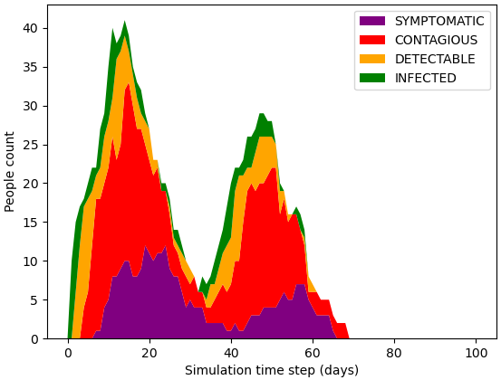

# Epidemic Simulator

This software simulates the spread of a contagious disease in an organization/neighborhood/city. 
Testing and isolation strategies can be examined during the simulation and useful metrics are 
collected. See our paper [TODO link to paper] for the extensive description of the probabilistic implemented in our simulator.

In brief, the simulation respects the community graph of people associated with diffrent groups. See an example of a community graph below:


Each person has the probability to bring the infection from outside the organization and to spread it within the groups he/she is associated with. Once the person becomes infected, his/her disease procceeds according to the state diagram below:


Further, we introduce the notion of an agent - a way to interact with the simulator and to allow testing of the individuals (subject to a constrained daily test budget) and to isolate certain people. Finally, the simulator provides useful metrics (see section "Metrics" down in the bottom of this page).

## Installation
The installaion requires Python 3.8.3.  
### Linux
The following commands will create a conda 
environment called "covidsim" and install all the required packages into it. 
This was tested on Ubuntu 18.04.
```
conda create -n covidsim python=3.8.3
source activate covidsim
pip install -r requirements.txt
sudo apt-get install python-glpk
sudo apt-get install glpk-utils
```

### Windows
The following commands will create a conda 
environment called "covidsim" and install all the required packages into it. 
This was tested on Windows 10.
1) Download the glpk solver from https://sourceforge.net/projects/winglpk/
2) Extract and place it in "Solvers" directory in the projects home
   make sure that the solver executable is accessible at the following path:
   Solvers/glpk-4.65/w64/glpsol.exe
3) Run the following commands in the command prompt:
```
conda create -n covidsim python=3.8.3
source activate covidsim
pip install -r requirements.txt
```

## Quick Start
The following script executes 5 simulation runs of a "two_clusters" dataset. 
Each run simulates 100 days during which the disease attempts to spread in the 
organization and each run focuses on one of 5 testing and isolation techniques
(no-policy, Symptom-based, Random-testing, Risk-factor-greedy, Optimization-based). 
For each of the runs, a separate subdirectory will be created under "Results" directory, and it
will contain the plots and the metrics collected from the simulation.

For Linux run the script using ```sh sample_runs.sh``` command. In Windows just click on the ```sample_runs.bat``` or run it in the command prompt.

The morbidity curves, indicating the number of ill people (at different illness stages) during each day, will look as follows (the no-policy is on the left-hand-side, whereas the optimization-based is on the right-hand-side side):

<p align="center">




</p>
## Usage

After a successful installation, you can use the simulator to simulate the disease spread on a dataset (or a community) of your own. There are 2 ways to run the simulator: (1) single run using ```main.py``` and a batched run using ```batch.py```. The Single run performs 1 simulation "game", and provides the run summary for this run only. The batched execution allows repetitive evaluation of the isolation and testing techniques (with different random seeds) for a statistical significance of the experiments and for a cross-comparison betwen several isolation methods.

For the simulator to work, you need 3 things: Excel file describing the dataset, Yaml file describing global configurations, txt file with some initial setup lines to start the simulation.
Below, I elaborate on how these files should be stuctured (you can also just use the attached "two_clusters" dataset as a reference).
### (1) Excel (xlsx) spreadsheet with five (05) sheets:
The Excel (xlsx) describes the simulated community graph, and the attributes of the individuals. 
It must contain with five (05) sheets:

1) "Organization" - people names and the groups they are associated with. You only need to maintain the first 5 column names(change the content in the rows below the header row), and you can modify the rest of the columns (the group association columns) by changing their names, adding more or removing some. 
2) "Ext_Risk" – Personal External risk factors, that indicate the likelihood (legal values: 0-5) of each person to get the infection from outside the institution. You can add as many risk factors as you like. But keep the first 5 column names (modify only the content of the non header rows).
3) "Int_risk" - Personal (Internal) risk factors, namely personal factors indicating the susceptibility (legal values: 0-5) of each person to an infection from within the organization. You can add as many risk factors as you like. But keep the first 3 columns intact.
4) "int_group_risk" - Group risk factors, namely factors (legal values: 0-5)  related to each group’s work environment. Here you must make sure to have an individual row per group, according to the groups you defined in the "Organization" sheet (as columns). You must only keep the first two columns (keep their names, whereas their content should be modified). The rest of the columns can be adjusted to your needs (values should be in 0..5).
5) "Init_simulation" - contains initial disease states of all the people for t=0 of the simulation and their ability to super-spread. You must keep all the columns (adjust their content without modifying their header names).
 
For all risk factors, 5 (also denoted as max_rate) stands for “increased risk of infection” when 0 means “reduced risk of infection”.

### (2) YAML  extension file to set up the Risk Manager this defines:
1) weights for the individuals external risk factors.
2) weights for the individuals internal risk factors.
3) weights for the groups' risk factors.
4) f_neg and f_pos function shapes (used for discounting the risk of the infection)
5) time_variables (in days) with their corresponding expectations and standard deviations. These means and standard deviations parameterize the corresponding gaussian distributions from which the illness stage durations will be sampled during the simulation. 
    
	(t1,s1) : Mean duration between time of INFECTION and time of DETECTION, and the associated standard deviation
   
	(t2,s2) : Mean duration between time of DETECTION and time of being CONTAGIOUS, and the associated standard deviation
   
	(t3,s3): Mean duration between time of being CONTAGIOUS and time of being NON-CONTAGIOUS, and the associated standard deviation 
   
	(t4,s4): Mean duration between time of being CONTAGIOUS and time of being SYMPOMATIC, and the associated standard deviation
   
	(t5,s5): Mean duration between time of being SYMPOMATIC and time of being NON-CONTAGIOUS, the associated standard deviation. 
   
6) Test error probabilities  (in [0,1] fractions) to represent the probability of returning a wrong test result of person x as a function of the state x resides at:
   
	P_test_error_idle – (False-Positive) a probability that a person in idle state is found Positive in a test. This value should be according to the commonly known false-positive rate.
   
	P_test_error_infected – (False-Negative), a probability that a person in infected state is found Negative in a test. This value should be quite high since the person is still not reached the detectable state.
   
	P_test_error_detectable – (False-Negative) a probability that a person in detectable state is found Negative in a test. This value should be much lower than P_test_error_infected.
   
	P_test_error_contagious – (False-Negative) a probability that a person in contagious state is found Negative in a test. This value should be much lower than P_test_error_infected.
   
	P_test_error_symptomatic – (False-Negative) a probability that a person in symptomatic state is found Negative in a test. This value should be much lower than P_test_error_infected.
   
	P_test_error_non_contagious – (False-Positive) a probability that a person in non-contagious state is found Positive in a test. This value should be according to the commonly known false-positive rate.

### (3) simulation_inputs.txt file to set up parameters:
1) Path of the spreadsheet 
   
2) Path of the .yaml file

3) The simulation start date

## Metrics
Each simulation run yields a run_summary with the following quantitative metrics:
1) Total Morbidity - total number of people that underwent the disease
2) Peak Morbidity - the maximum number of ill people in a given day as inspected across the entire simulation.
3) PQE(x) - personal quarantine efficiency of person x - given by the sum of the days the person was isolated and contagious divided by the sum of his isolation and illness days (sort of intersection-over-union)
4) mPQE(x) - mean personal quarantine efficiency - an average across all the PQEx scores of all the people in the simulated community.
5) GQE - global quarantine efficiency - a ratio between the total human-days during which ill people were isolated and the sum of the illness + isolation days (again, this is sort of an intersection-over-union metric, but this time it treats each human-day equally rather than treating each person equally was the case in mPQE).
