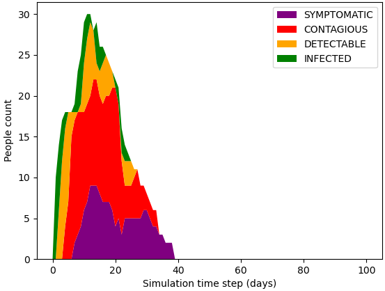
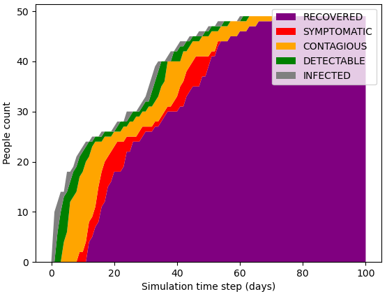
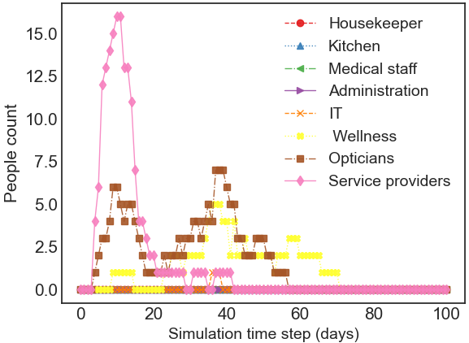
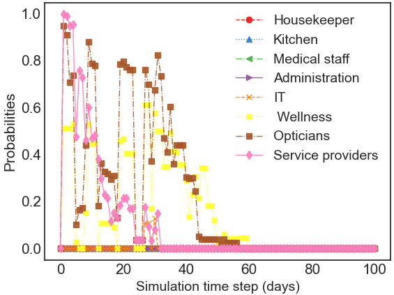
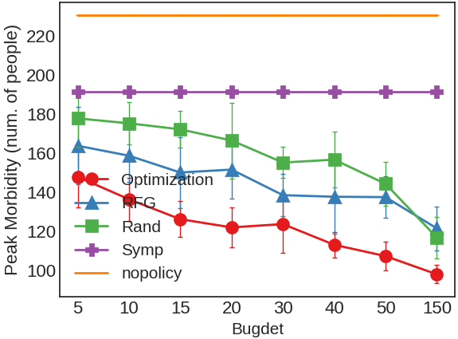
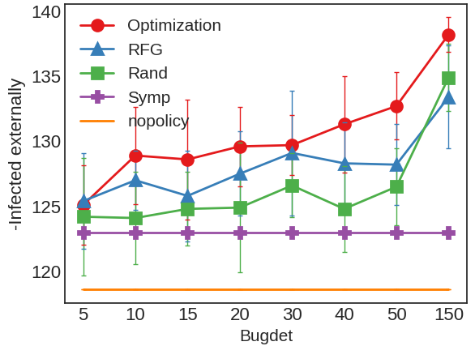

# Epidemic Simulator

This software simulates the spread of a contagious disease in a community (organization, neighborhood, city, etc.). 
Testing and isolation strategies can be examined during the simulation and useful metrics are 
collected. See our paper [link to the paper will be posted upon acceptance] for the extensive description of the probabilistic implemented in our simulator.

In brief, the simulation respects the **hyper-graph** of people associated with different groups. See an example of a graph below, where 14 people ( 9 students, 3 teachers a manager and a secretary) are associated with 3 groups (Class 1, Class 2, and Management). Each person can belong to 0 or more groups:

<p align="center">

</p>

Each person has the probability to bring the infection from outside the community anda probability to spread it within the groups he/she is associated with. The computation of these probabilities is elaborated in the paper. Once the person becomes infected, his/her disease proceeds according to the **illness state diagram** below:

<p align="center">

</p>

Further, we introduce the notion of an **agent** - a way to interact with the simulator and to allow testing of the individuals (subject to a constrained daily test budget) and to isolate certain people. We provide 5 built in agents: _nopolicy_ - do not quarantine people; _Symp_ - symptom based quarantine, the first day a person shows symptoms - he/she is quarantined; _Rand(B)_ - Random sampling of B people every day, sending them to test and quarantining the positives; _RFG(B)_ - Risk Factor Greedy approach ranks the people according to their risk factors and sends the top-B to testing, quarantine is applied to the positively tested ones; _Optimization_ - choosing B people by solving a linear program that aims to fairly select people from all the groups, then the B selected people are sent for testing, and the positives go to quarantine. Finally, the simulator provides useful metrics (see section "Metrics" down in the bottom of this page). For a high-level interaction between the simulator and the agent, refer to the image below:

<p align="center">

</p>

## Installation
The installation requires Python 3.8.3.  
### Linux
The following commands will create a conda 
environment called "covidsim" and install all the required packages into it. 
This was tested on Ubuntu 18.04.
```
git clone https://github.com/kostyanoob/Epidemic-Simulator.git
cd Epidemic-Simulator
conda create -n covidsim python=3.8.3
source activate covidsim
pip install -r requirements.txt
sudo apt-get install python-glpk
sudo apt-get install glpk-utils
```

### Windows
The following commands will create a conda 
environment called "covidsim" and install all the required packages into it. 
This was tested on Windows 10.
1) Download or clone this Epidemic-Simulator repository
2) Download the glpk solver from https://sourceforge.net/projects/winglpk
3) Extract and place it in "Solvers" directory in the project's home
   make sure that the solver executable is accessible at the following path:
   <project-home>/Solvers/glpk-4.65/w64/glpsol.exe
4) Run the following commands in the command prompt:
```
conda create -n covidsim python=3.8.3
source activate covidsim
pip install -r requirements.txt
```

## Quick Start
We provide and example dataset named "two_clusters" dataset, a hundred people company and 8 groups. The connectivity of the people forms 2 two group clusters with only 2 people associated with both of these clusters (check out a [sketch of this graph](https://github.com/kostyanoob/Epidemic-Simulator/blob/main/Dataset/two_clusters/Organization_structure.png)). 

The following script executes 5 simulation runs of a "two_clusters" dataset, each run simulates 100 days during which the disease attempts to spread in the 
community and each run focuses on one of 5 testing and isolation techniques
(no-policy, Symptom-based, Random-testing, Risk-factor-greedy, Optimization-based). 
For each of the runs, a separate subdirectory will be created under "Results" directory, and it
will contain the plots, and the metrics collected from the simulation.

For Linux run the script using ```sh sample_runs.sh``` command. In Windows just click on the ```sample_runs.bat``` or run it in the command prompt.

The morbidity curves, indicating the number of ill people (at different illness stages) during each day, will look as follows (the no-policy is on the left-hand-side, whereas the optimization-based is on the right-hand-side side):

<p align="center">




</p>

## Usage

After a successful installation, you can use the simulator to simulate the disease spread on a dataset (or a community) of your own. There are 2 ways to run the simulator: **single run** using ```main.py``` and a **batched run** using ```batch.py```. The Single run performs 1 simulation "game", and provides the run summary for this run only. The batched execution allows repetitive evaluation of the isolation and testing techniques (with different random seeds) for a statistical significance of the experiments and for a cross-comparison between several isolation methods.

For the simulator to work, you need 3 things: Excel file describing the dataset, Yaml file describing global configurations, txt file with some initial setup lines to start the simulation.
Below, I elaborate on how these files should be structured (you can also just use the attached "two_clusters" dataset as a reference).
### (1) Excel (xlsx) file in the "Dataset" directory
The Excel (xlsx) describes the simulated hyper-graph, and the attributes of the individuals and of the groups. It must contain with five sheets:

1) "Organization" - people names and the groups they are associated with. You only need to maintain the first 5 column names(change the content in the rows below the header row), and you can modify the rest of the columns (the group association columns) by changing their names, adding more or removing some. 
2) "Ext_Risk" – Personal External risk factors, that indicate the likelihood (legal values: [0...5]) of each person to get the infection from outside the institution. You can add as many risk factors as you like. But keep the first 5 column names (modify only the content of the non header rows).
3) "Int_risk" - Personal (Internal) risk factors, namely personal factors indicating the susceptibility (legal values: 0-5) of each person to an infection from within the organization. You can add as many risk factors as you like. But keep the first 3 columns intact.
4) "int_group_risk" - Group risk factors, namely factors (legal values: [0...5])  related to each group’s work environment. Here you must make sure to have an individual row per group, according to the groups you defined in the "Organization" sheet (as columns). You must only keep the first two columns (keep their names, whereas their content should be modified). The rest of the columns can be adjusted to your needs (values should be in [0...5]).
5) "Init_simulation" - contains initial disease states of all the people for t=0 of the simulation and their ability to super-spread. You must keep all the columns (adjust their content without modifying their header names).
 
For all risk factors, 5 (also denoted as max_rate) stands for “increased risk of infection” when 0 means “reduced risk of infection”.

### (2) YAML file in the "Configurations" directory
1) weights for the individuals external risk factors.
2) weights for the individuals internal risk factors.
3) weights for the groups' risk factors.
4) f_neg and f_pos function shapes (used for discounting the risk of the infection)
5) time_variables (in days) with their corresponding expectations and standard deviations. These means and standard deviations (STD) parameterize the corresponding gaussian (and exponential) distributions from which the illness stage durations will be sampled during the simulation (an independent drawing for each illness session).
    
	(t1,s1) : Mean, STD of Gaussian distribution from which the simulator draws T1 - the duration of the INFECTED stage.
	
	(t2,s2) : Mean, STD of Gaussian distribution from which the simulator draws T2 - the duration of the DETECTABLE stage.
   
	(t3,s3): Mean, STD of Gaussian distribution from which the simulator draws T3 - the duration of the CONTAGIOUS-A-SYMPTOMATIC stage.
   
	(t4,s4): Shift,lambda parameter of Exponential distribution, from which the simulator draws T4 - the duration the CONTAGIOUS-PRE-SYMPTOMATIC stage.
   
	(t5,s5): Mean, STD of Gaussian distribution, from which the simulator draws T5 - the duration the CONTAGIOUS-SYMPTOMATIC stage.
   
6) Test error probabilities  (in [0,1] fractions) to represent the probability of returning a wrong test result of person x as a function of the state x resides at:
   
	P_test_error_idle – (False-Positive) a probability that a person in SUSCEPTIBLE state is found Positive in a test. This value should be according to the commonly known false-positive rate.
   
	P_test_error_infected – (False-Negative), a probability that a person in INFECTED state is found Negative in a test. This value should be quite high since the person is still not reached the detectable state.
   
	P_test_error_detectable – (False-Negative) a probability that a person in DETECTABLE state is found Negative in a test. This value should be much lower than P_test_error_infected.
   
	P_test_error_contagious – (False-Negative) a probability that a person in PRE-SYMPTOMATIC state is found Negative in a test. This value should be much lower than P_test_error_infected.
   
	P_test_error_symptomatic – (False-Negative) a probability that a person in SYMPTOMATIC or in ASYMPTOMATIC state is found Negative in a test. This value should be much lower than P_test_error_infected.
   
	P_test_error_non_contagious – (False-Positive) a probability that a person in RECOVERED state is found Positive in a test. 
	
### (3) simulation_inputs.txt file to set up parameters:
1) Path of the dataset Excel file 
   
2) Path of the configuration YAML file

3) The simulation start date (this is important since inside the Excel file there is a date-sensitive information, on purpose.)

## Metrics
When performing a **single simulation** run, the simulator produces a ```run_summary.txt``` file with the following quantitative metrics:
1) Total Morbidity - total number of people that underwent the disease (split into ones that were infected externally and ones that were infected from the inside of the community)
2) Peak Morbidity - the maximum number of ill people in a given day as inspected across the entire simulation.
3) PQE(x) - personal quarantine efficiency of person x - given by the sum of the days the person was isolated and contagious divided by the sum of his isolation and illness days (sort of intersection-over-union)
4) mPQE(x) - mean personal quarantine efficiency - an average across all the PQEx scores of all the people in the simulated community.
5) GQE - global quarantine efficiency - a ratio between the total human-days during which ill people were isolated and the sum of the illness + isolation days (again, this is sort of an intersection-over-union metric, but this time it treats each human-day equally rather than treating each person equally was the case in mPQE).
6) Number of quarantined people
7) Agent efficiency counters: percentage of human-days (our of all people*simulation_duration) during which the person was "healthy and not-quarantined", "contagious and quarantined", "healthy and quarantined", "contagious and non-quarantined".

In addition, the simulator can also output 2 very useful log files: ```Daily_logs.csv``` and ```Isolation_logs.csv``` that describe the illness state of each person (according to the FSM) and whether the person is quarantined. These logs are very descriptive as they describe the state of each person at each day. Moreover, the simulator produces various plot figures (different figures for single simulation and for batched runs). Example of the produced plots are presented below (left to right): Total morbidity over time, Apparent morbidity at each day, Ill people count per group as a function of time, Probability for an outbreak per group as a function of time.

<p align="center">




</p>

When performing a **batched run**, exploring several test budgets and several agents (i.e. isolation and testing strategies) the simulator creates plots showing with the average metrics (GQE, mPQE, Morbidity, etc.) as a function of the daily test budget. Standard deviation bars are shown as well (computed across the repetitions of the batch with different random seeds). Below are some examples for the plots produced in a batched simulation over a larger community (1000 people). Upper row left to right: GQE, mPQE, Isolated people count, bar plot showing ill and isolated people-day count in green, ill and non-isolated people-days count in red, healthy and isolated people-days count in gray. Bottom row: peak morbidity, total morbidity (total count of infected people), total count of people who were infected externally, total count of people who were infected internally.

<p align="center">


<br>




</p>

## Extra tools
Another couple of useful tools are ```explore_graph.py``` and ```explore_data.py```. 

The ```explore_graph.py``` analyzes your dataset (Excel file) and shows interesting statistics regarding the connectivity of the graph (inter-people connectivity, such as radius and expansion ratio). 

The ```explore_data.py``` is a script that allows you to re-render the plots from a given batched run. This can be useful for example if you were not satisfied with the font size of the plots that were generated by the end of your batch run. Moreover, when your batch run is lengthy (it could take several days if you use a big community graph, and you perform many repetitions) then using ```--recover``` option of this script will generate plots from the batch repetitions that have managed to finish so far. This is greatly important if you want to take a quick peek at the results, to identify bugs for example. To use the recovery option, make sure to have your batch running with ```-output_products run_summary``` such that each individual run produces a "checkpoint" of its results.